# Flutter アーキテクチャパターン比較

同一仕様のTodoアプリを3つの異なるアーキテクチャパターン＋状態管理ライブラリで実装し、多角的に比較した結果をまとめる。

---

## 1. 全体概要

### Provider + MVVM

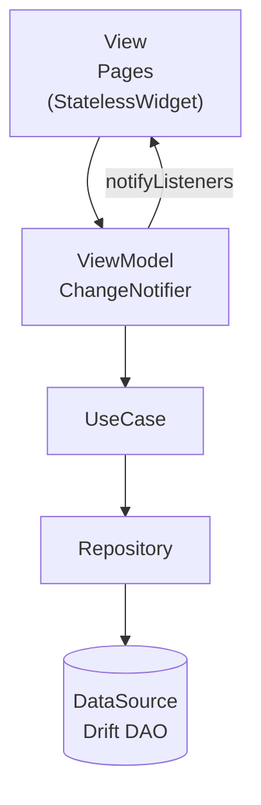

- UI → `context.watch<ViewModel>()` で状態を購読
- ViewModel が `notifyListeners()` で UI に変更を通知
- UseCase を経由して Repository を呼び出す

### BLoC Pattern

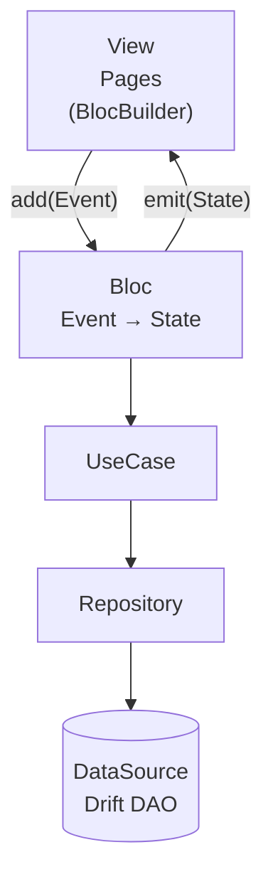

- UI → `bloc.add(Event)` でイベントを送信
- Bloc が Event を処理し、新しい State を `emit`
- 厳密な単方向データフローを強制

### Riverpod + MVVM

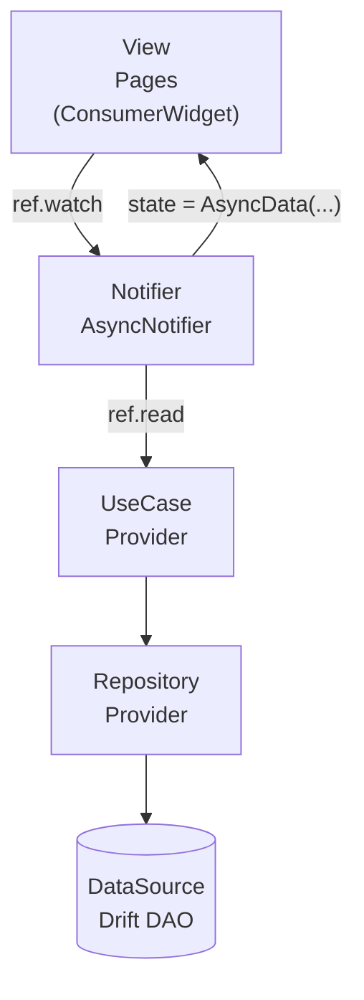

- UI → `ref.watch(notifierProvider)` で状態を自動購読
- Notifier が `state` を更新すると UI が自動再描画
- 全ての依存関係が `@riverpod` コード生成で自動解決

| 項目               | Provider + MVVM                    | BLoC Pattern                      | Riverpod + MVVM                |
| ------------------ | ---------------------------------- | --------------------------------- | ------------------------------ |
| **アーキテクチャ** | MVVM                               | BLoC (単方向データフロー)         | MVVM                           |
| **状態管理**       | Provider (ChangeNotifier)          | flutter_bloc (Bloc/Cubit)         | Riverpod (AsyncNotifier)       |
| **DI方式**         | MultiProvider (ウィジェットツリー) | BlocProvider (ウィジェットツリー) | Riverpod Provider (コード生成) |
| **状態の型**       | ミュータブル (notifyListeners)     | イミュータブル (Event→State)      | イミュータブル (AsyncValue)    |

### 1.2 プロジェクト概要

#### 画面一覧

| 画面名             | ファイル名              | 概要                                                                                                              |
| ------------------ | ----------------------- | ----------------------------------------------------------------------------------------------------------------- |
| Todo一覧画面       | `todo_list_page.dart`   | Tab 1のルート画面。Todoの一覧表示・ステータスフィルタリング（全て / 未完了 / 完了）・削除（スワイプ）・完了トグル |
| Todo作成画面       | `create_todo_page.dart` | Todo一覧画面のFABをタップして遷移。タイトル・メモを入力してDB登録                                                 |
| Todo詳細・編集画面 | `todo_detail_page.dart` | 一覧アイテムをタップして遷移。タイトル・メモの編集・削除が可能                                                    |
| 統計画面           | `stats_page.dart`       | Tab 2のルート画面。全件数・完了数・未完了数の集計表示                                                             |

#### 各画面の機能詳細

##### Todo一覧画面（`todo_list_page.dart`）

- BottomNavigationBar の Tab 1 に対応
- Drift経由でTodoを全件取得して一覧表示（Stream監視でリアルタイム更新）
- フィルタチップ（全て / 未完了 / 完了）でリスト絞り込み
- 各アイテムにチェックボックスを設け、タップで完了/未完了をトグル（Update）
- スワイプ削除（Dismissible）
- FAB（FloatingActionButton）タップでTodo作成画面へ遷移
- 一覧アイテムタップでTodo詳細・編集画面へ遷移

##### Todo作成画面（`create_todo_page.dart`）

- タイトル入力フィールド（必須）
- メモ入力フィールド（任意・複数行）
- 「保存」ボタンでDBへInsertし、一覧画面に戻る
- バリデーション：タイトル未入力時はエラーメッセージ表示

##### Todo詳細・編集画面（`todo_detail_page.dart`）

- 一覧から選択したTodoの内容を表示・編集
- タイトル・メモの編集が可能
- 「更新」ボタンでDBへUpdateし、一覧画面に戻る
- 「削除」ボタンでDBからDeleteし、一覧画面に戻る
- 完了状態のトグルも可能

##### 統計画面（`stats_page.dart`）

- BottomNavigationBar の Tab 2 に対応
- Drift経由で集計：総Todo数・完了数・未完了数を表示
- グラフ等は使わず、テキストベースのシンプルな表示

#### 画面遷移図

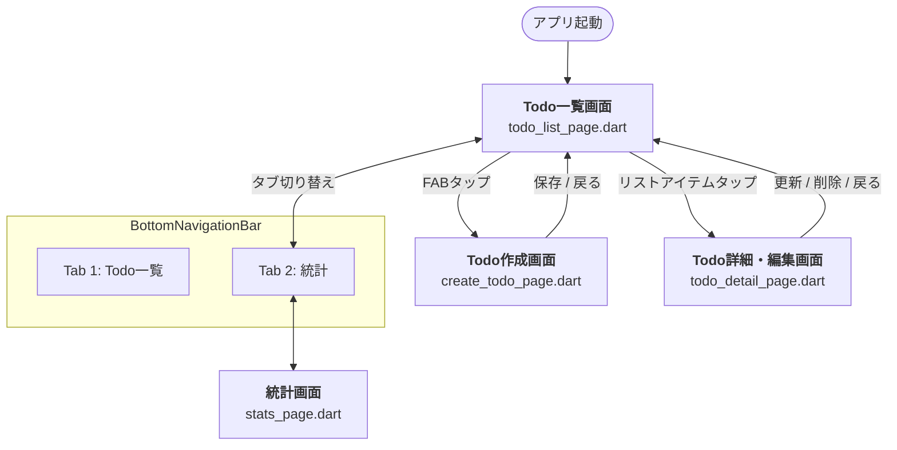

---

## 2. プロジェクトのフォルダ構成比較

3プロジェクトは共通の Clean Architecture レイヤー構成をベースとしつつ、状態管理層のフォルダ名・ファイル構成が異なる。

### 2.1 フォルダツリー（lib/ 配下、生成ファイルを除く）

> ★ マークが各パターンで異なる「状態管理層」のフォルダ

Provier + MVVM

```
lib/
├── main.dart
├── app.dart
├── core/
│   ├── constants/
│   │   ├── app_font_size.dart
│   │   ├── app_spacing.dart
│   │   └── filter_type.dart
│   ├── database/
│   │   ├── app_database.dart
│   │   └── tables/
│   │       └── todo_table.dart
│   ├── router/
│   │   └── app_router.dart
│   └── theme/
│       └── app_theme.dart
└── features/todo/
    ├── domain/
    │   ├── entity/
    │   │   ├── todo.dart
    │   │   └── todo_stats.dart
    │   └── repository/
    │       └── todo_repository.dart
    ├── repository/
    │   ├── todo_local_source.dart
    │   ├── todo_local_source_interface.dart
    │   └── todo_repository_impl.dart
    ├── usecase/
    │   ├── add_todo_usecase.dart
    │   ├── delete_todo_usecase.dart
    │   ├── get_todo_by_id_usecase.dart
    │   ├── get_todos_usecase.dart
    │   └── update_todo_usecase.dart
    ├── view_model/           ← ★
    │   └── todo_view_model.dart
    └── pages/
        ├── create_todo_page.dart
        ├── stats_page.dart
        ├── todo_detail_page.dart
        └── todo_list_page.dart
```

BLoC

```
lib/
├── main.dart
├── app.dart
├── core/
│   ├── constants/
│   │   ├── app_font_size.dart
│   │   ├── app_spacing.dart
│   │   └── filter_type.dart
│   ├── database/
│   │   ├── app_database.dart
│   │   └── tables/
│   │       └── todo_table.dart
│   ├── router/
│   │   └── app_router.dart
│   └── theme/
│       └── app_theme.dart
└── features/todo/
    ├── bloc/                 ← ★
    │   ├── todo_bloc.dart
    │   ├── todo_event.dart
    │   ├── todo_state.dart
    │   ├── stats_bloc.dart
    │   ├── stats_event.dart
    │   └── stats_state.dart
    ├── domain/
    │   ├── entity/
    │   │   ├── todo.dart
    │   │   └── todo_stats.dart
    │   └── repository/
    │       └── todo_repository.dart
    ├── repository/
    │   ├── todo_local_source.dart
    │   └── todo_repository_impl.dart
    ├── usecase/
    │   ├── add_todo_usecase.dart
    │   ├── delete_todo_usecase.dart
    │   ├── get_stats_usecase.dart
    │   ├── get_todo_by_id_usecase.dart
    │   ├── get_todos_usecase.dart
    │   └── update_todo_usecase.dart
    └── pages/
        ├── create_todo_page.dart
        ├── stats_page.dart
        ├── todo_detail_page.dart
        └── todo_list_page.dart
```

Riverpod + MVVM

```
lib/
├── main.dart
├── app.dart
├── core/
│   ├── constants/
│   │   ├── app_font_size.dart
│   │   ├── app_spacing.dart
│   │   └── filter_type.dart
│   ├── database/
│   │   ├── app_database.dart
│   │   └── tables/
│   │       └── todo_table.dart
│   ├── router/
│   │   └── app_router.dart
│   └── theme/
│       └── app_theme.dart
└── features/todo/
    ├── domain/
    │   ├── entity/
    │   │   ├── todo.dart
    │   │   └── todo_stats.dart
    │   └── repository/
    │       └── todo_repository.dart
    ├── repository/
    │   ├── todo_local_source.dart
    │   ├── todo_repository_impl.dart
    │   └── todo_repository_provider.dart
    ├── usecase/
    │   ├── add_todo_usecase.dart
    │   ├── delete_todo_usecase.dart
    │   ├── get_stats_usecase.dart
    │   ├── get_todo_by_id_usecase.dart
    │   ├── get_todos_usecase.dart
    │   └── update_todo_usecase.dart
    ├── notifier/             ← ★
    │   ├── todo_notifier.dart
    │   └── stats_notifier.dart
    └── pages/
        ├── create_todo_page.dart
        ├── stats_page.dart
        ├── todo_detail_page.dart
        └── todo_list_page.dart
```

### 2.2 フォルダ構成の違い詳細

#### 共通構造（core/ と domain/）

3プロジェクトとも `core/`（定数・DB・ルーティング・テーマ）と `domain/`（エンティティ・リポジトリIF）は**完全に同一構造**。これはアーキテクチャの下層レイヤーが状態管理手法に依存しないことを示している。

#### 状態管理層の構造差

| 比較ポイント                | Provider + MVVM            | BLoC Pattern                          | Riverpod + MVVM             |
| --------------------------- | -------------------------- | ------------------------------------- | --------------------------- |
| **フォルダ名**              | `view_model/`              | `bloc/`                               | `notifier/`                 |
| **状態管理ファイル数**      | 1ファイル（TodoViewModel） | 6ファイル（Bloc×2, Event×2, State×2） | 2ファイル（Notifier×2）     |
| **統計機能の実装場所**      | TodoViewModel 内で算出     | 専用の StatsBloc に分離               | 専用の StatsNotifier に分離 |
| **1機能あたりのファイル数** | 1                          | 3（Bloc + Event + State）             | 1（+ 生成ファイル）         |

- **Provider**: 最もコンパクト。TodoViewModel 1ファイルに全ロジックを集約。統計情報もViewModel内で計算するためStatsの専用UseCaseが不要。
- **BLoC**: ファイル数が最多。機能ごとに Bloc / Event / State の3ファイルが必要。ただし各ファイルの責務が明確で、大規模プロジェクトではこの分離がメリットになる。
- **Riverpod**: Notifier は機能ごとに1ファイルだが、各ファイルに対して `.g.dart` 生成ファイルが伴う。`todo_repository_provider.dart` のように DI 用の Provider 定義ファイルも追加で必要。

#### Repository 層の違い

| 比較ポイント                       | Provider + MVVM                         | BLoC Pattern                | Riverpod + MVVM                      |
| ---------------------------------- | --------------------------------------- | --------------------------- | ------------------------------------ |
| **LocalSource のインターフェース** | `todo_local_source_interface.dart` あり | なし（直接依存）            | なし（直接依存）                     |
| **DI用 Provider ファイル**         | なし（main.dart で一括登録）            | なし（app.dart で一括登録） | `todo_repository_provider.dart` あり |

Provider版のみ LocalSource に対してインターフェースを切っている。これはテスト時に FakeLocalSource を注入するための設計。BLoC / Riverpod 版では Repository レベルでのFake差し替えのみ行っている。

#### View 層の違い

| 比較ポイント           | Provider + MVVM       | BLoC Pattern                           | Riverpod + MVVM                             |
| ---------------------- | --------------------- | -------------------------------------- | ------------------------------------------- |
| **フォルダパス**       | `pages/`              | `pages/`                               | `pages/`                                    |
| **ベースウィジェット** | `StatelessWidget`     | `StatelessWidget`                      | `ConsumerWidget` / `ConsumerStatefulWidget` |
| **状態の取得方法**     | `context.watch<VM>()` | `context.read<Bloc>()` + `BlocBuilder` | `ref.watch(provider)`                       |

Riverpod版は `view/` サブフォルダを省略して `pages/` 直下に配置しており、よりフラットな構造。また、Riverpod専用の `ConsumerWidget` を使う必要がある点が他2つと異なる。

---

## 3. コード量の比較

### 3.1 ファイル数

| 項目                    | Provider + MVVM | BLoC Pattern | Riverpod + MVVM |
| ----------------------- | :-------------: | :----------: | :-------------: |
| **lib/ 手書きファイル** |       25        |      30      |       27        |
| **lib/ 生成ファイル**   |        5        |      9       |       14        |
| **test/ ファイル**      |        9        |      10      |       12        |
| **lib/ 合計**           |       30        |      39      |       41        |

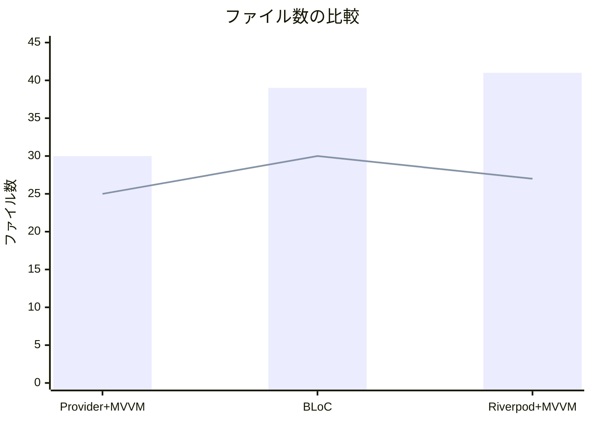

> **ポイント**: BLoCは Event / State を個別ファイルに分離するため手書きファイル数が最多。Riverpod はコード生成ファイル（`.g.dart`）が多い。Providerは最もファイル数が少ない。

### 3.2 コード行数（手書きのみ。生成コードを除く）

| 項目           | Provider + MVVM | BLoC Pattern | Riverpod + MVVM |
| -------------- | :-------------: | :----------: | :-------------: |
| **lib/ 行数**  |      1,478      |    1,485     |      1,322      |
| **test/ 行数** |       794       |     586      |       973       |
| **合計行数**   |      2,272      |    2,071     |      2,295      |

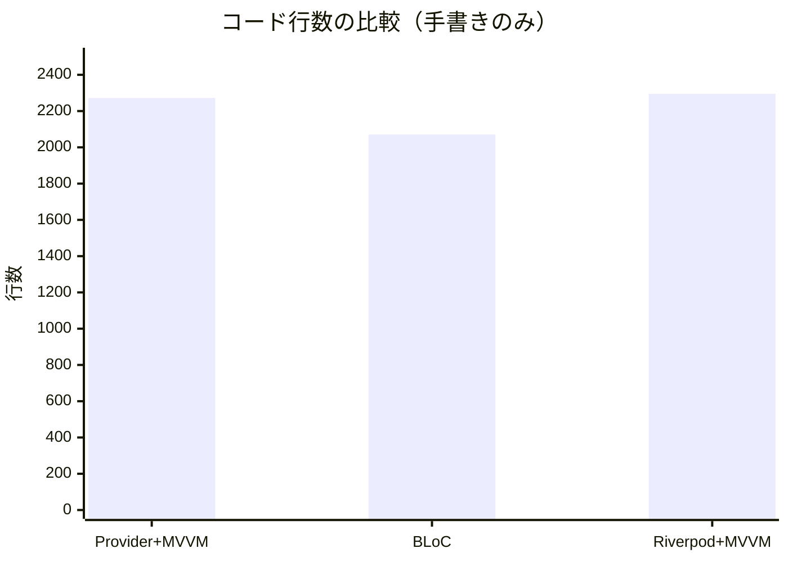

> **ポイント**: lib/ のプロダクションコード量は3パターンほぼ同等（1,300〜1,500行）。Riverpodはテストコードが最も多い（WidgetテストやNotifierテストを含む）。BLoCはテストコードが最も少ないが、bloc_testによる簡潔な記述が寄与している。

---

## 4. アーキテクチャ詳細比較

### 4.1 状態管理の仕組み

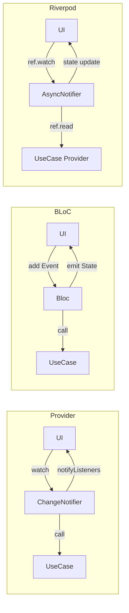

#### Provider + MVVM

- `ChangeNotifier` を継承した ViewModel が状態を保持
- `notifyListeners()` でUIに変更を通知
- `context.watch<TodoViewModel>()` でUIが購読
- **ミュータブル**な状態管理（フィールドを直接更新）

#### BLoC Pattern

- **Event** を受け取り **State** を出力する単方向データフロー
- `emit.forEach()` で Stream を購読し、自動的に State を更新
- freezed で Event / State をイミュータブルに定義
- **厳密な単方向データフロー**を強制

#### Riverpod + MVVM

- `AsyncNotifier` / `StreamNotifier` を使用
- `ref.watch()` でプロバイダを自動購読
- コード生成（`@riverpod`）で Provider を自動生成
- `AsyncValue<T>` で Loading / Error / Data 状態を型安全に管理

### 4.2 DI（依存性注入）の方式

| 方式                 | Provider + MVVM                            | BLoC Pattern                             | Riverpod + MVVM                        |
| -------------------- | ------------------------------------------ | ---------------------------------------- | -------------------------------------- |
| **DI手法**           | `MultiProvider` でウィジェットツリーに注入 | `MultiBlocProvider` + コンストラクタ注入 | `@riverpod` アノテーションでコード生成 |
| **セットアップ場所** | `main.dart` で全UseCase/VMを登録           | `app.dart` で全BLoC/UseCaseを登録        | 各ファイルで `@riverpod` を宣言        |
| **スコープ管理**     | ウィジェットツリーに依存                   | ウィジェットツリーに依存                 | グローバル（ProviderScope）            |
| **遅延初期化**       | 不可（起動時に全て生成）                   | 不可（起動時に全て生成）                 | 可能（アクセス時に初期化）             |

---

## 5. 各観点での評価

### 5.1 総合評価レーダーチャート

> ※ 5段階評価（5が最高）

| 評価観点                     | Provider + MVVM | BLoC Pattern | Riverpod + MVVM |
| ---------------------------- | :-------------: | :----------: | :-------------: |
| **テスタビリティ**           |    ⭐⭐⭐⭐     |  ⭐⭐⭐⭐⭐  |   ⭐⭐⭐⭐⭐    |
| **コード実装の容易さ**       |   ⭐⭐⭐⭐⭐    |    ⭐⭐⭐    |    ⭐⭐⭐⭐     |
| **可読性**                   |    ⭐⭐⭐⭐     |  ⭐⭐⭐⭐⭐  |    ⭐⭐⭐⭐     |
| **保守性**                   |     ⭐⭐⭐      |  ⭐⭐⭐⭐⭐  |    ⭐⭐⭐⭐     |
| **習熟の容易さ**             |   ⭐⭐⭐⭐⭐    |    ⭐⭐⭐    |     ⭐⭐⭐      |
| **スケーラビリティ**         |     ⭐⭐⭐      |  ⭐⭐⭐⭐⭐  |   ⭐⭐⭐⭐⭐    |
| **ボイラープレートの少なさ** |    ⭐⭐⭐⭐     |     ⭐⭐     |     ⭐⭐⭐      |
| **型安全性**                 |     ⭐⭐⭐      |  ⭐⭐⭐⭐⭐  |   ⭐⭐⭐⭐⭐    |

### 5.2 テスタビリティ

| 項目                   | Provider + MVVM                 | BLoC Pattern                            | Riverpod + MVVM                 |
| ---------------------- | ------------------------------- | --------------------------------------- | ------------------------------- |
| **テストファイル数**   | 9                               | 10                                      | 12                              |
| **テスト行数**         | 794                             | 586                                     | 973                             |
| **テストヘルパー**     | FakeRepository, FakeLocalSource | FakeRepository                          | FakeRepository, FakeLocalSource |
| **テスト用ライブラリ** | flutter_test のみ               | flutter_test + bloc_test                | flutter_test のみ               |
| **状態検証方法**       | VMのプロパティを直接確認        | `bloc_test` の `expect` で State を検証 | NotifierのStateを検証           |

**詳細分析:**

- **BLoC**: `bloc_test` パッケージの `blocTest()` 関数により、Event投入→State遷移を宣言的にテスト可能。テストコードが最も簡潔。Event / State がイミュータブルなため副作用がなく安定。
- **Riverpod**: `ProviderContainer` のオーバーライド機能でDI差し替えが容易。ウィジェットテスト（CreateTodoPage）も実装されている。テストが最も包括的。
- **Provider**: ChangeNotifier の `notifyListeners()` をテストで検証。FakeRepository を手動で作成。シンプルだがミュータブル状態のため、テスト間の副作用に注意が必要。

### 5.3 コード実装の容易さ

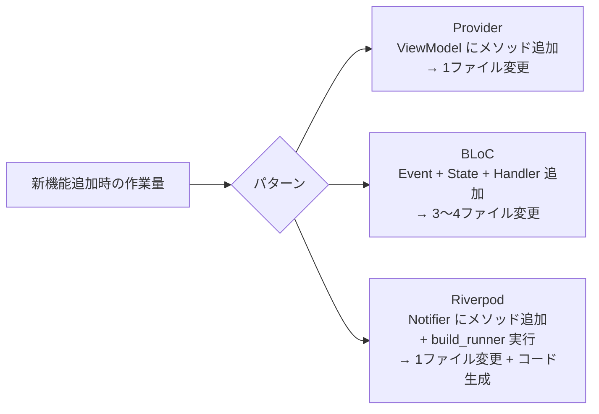

- **Provider**: 最もシンプル。ChangeNotifier にメソッドを追加し `notifyListeners()` を呼ぶだけ。Flutter 公式ドキュメントで推奨されていた実績あり。
- **BLoC**: Event クラス、State クラス、Bloc の `on<Event>` ハンドラの3箇所を変更する必要がある。ボイラープレートが多いが、freezed で軽減。
- **Riverpod**: Notifier にロジックを追加後、`build_runner` でコード生成が必要。Provider に近い手軽さだが、コード生成の一手間がある。

### 5.4 可読性

| 観点                     | Provider + MVVM                  | BLoC Pattern                      | Riverpod + MVVM               |
| ------------------------ | -------------------------------- | --------------------------------- | ----------------------------- |
| **データフローの明確さ** | △ 暗黙的（notifyListeners）      | ◎ Event→State で追跡容易          | ○ ref.watch で宣言的          |
| **状態の予測容易性**     | △ ミュータブルで変更箇所が不明瞭 | ◎ イミュータブルで変更が明示的    | ○ AsyncValue で状態が明確     |
| **ファイル間の関係性**   | ○ シンプルな依存関係             | △ Event/State/Bloc ファイルが分散 | ○ Provider で依存関係が明示的 |
| **初見でのコード理解**   | ◎ 直感的で理解しやすい           | ○ パターンを知っていれば明快      | △ Riverpod固有の概念が多い    |

### 5.5 保守性

- **Provider**: プロジェクトが大きくなると、ChangeNotifier の肥大化が問題になりやすい。状態の変更箇所が追跡しづらく、バグの原因特定が困難になる可能性がある。
- **BLoC**: Event / State が明示的なため、どの操作がどの状態変化を引き起こすか追跡しやすい。大規模プロジェクトでの保守性が最も高い。
- **Riverpod**: Provider ごとにスコープが明確。`ref.watch` による自動依存関係追跡がリファクタリングを支援。コード生成への依存がやや懸念。

### 5.6 習熟の容易さ

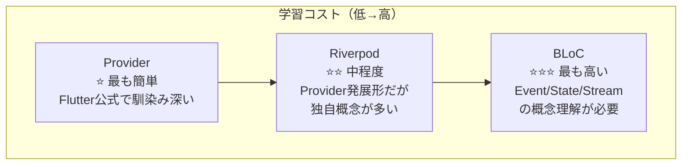

| 学習項目                 |    Provider + MVVM     |       BLoC Pattern       |       Riverpod + MVVM       |
| ------------------------ | :--------------------: | :----------------------: | :-------------------------: |
| **基本概念の習得**       |          容易          |          難しい          |         やや難しい          |
| **必要な前提知識**       | InheritedWidget の基礎 | Stream, イベント駆動設計 | Provider の基礎, コード生成 |
| **公式ドキュメント**     |          豊富          |           豊富           |            豊富             |
| **コミュニティリソース** |       非常に多い       |        非常に多い        |           増加中            |
| **初心者向き度**         |           ◎            |            △             |              ○              |

---

## 6. 依存ライブラリの将来性

### 6.1 主要ライブラリの比較

| ライブラリ                       | pub.dev Likes | 最終更新 |             メンテナー             |      将来性評価       |
| -------------------------------- | :-----------: | :------: | :--------------------------------: | :-------------------: |
| **provider** (^6.1.2)            |    8,000+     |   活発   |           Remi Rousselet           | ⚠️ メンテナンスモード |
| **flutter_bloc** (^9.1.1)        |    6,000+     |   活発   | Felix Angelov (Very Good Ventures) |     ✅ 非常に安定     |
| **flutter_riverpod** (^3.2.1)    |    4,000+     |   活発   |           Remi Rousselet           |    ✅ 活発に開発中    |
| **riverpod_annotation** (^4.0.2) |       —       |   活発   |           Remi Rousselet           |    ✅ 活発に開発中    |

### 6.2 将来性の詳細分析

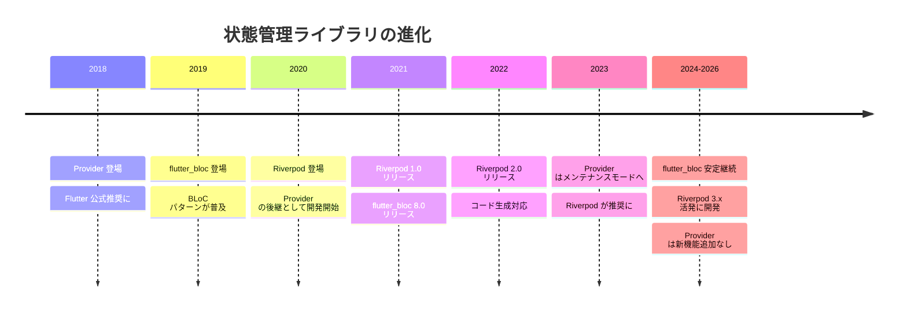

#### Provider

- **作者**: Remi Rousselet（Riverpod と同一人物）
- **現状**: メンテナンスモード。セキュリティ修正は行われるが、新機能追加は予定なし
- **リスク**: 作者自身が Riverpod への移行を推奨。長期的には段階的に使用が減少する見込み
- **評価**: ⚠️ 既存プロジェクトの維持は問題ないが、新規プロジェクトでの採用は非推奨

> **公式の移行案内**: Riverpod 公式ドキュメントに「Provider から Riverpod への移行動機」ページがあり、Provider の制限事項を詳細に列挙した上で **"You probably should be using Riverpod"** と明記している。Riverpod は Provider の「精神的後継（spiritual successor）」として設計されており、パッケージ名も Provider のアナグラムである。
>
> 参考URL: https://riverpod.dev/docs/from_provider/motivation

#### flutter_bloc

- **作者**: Felix Angelov (Very Good Ventures 社)
- **現状**: 企業バックで安定的にメンテナンス。メジャーバージョンアップも定期的
- **強み**: Very Good Ventures は Flutter コンサルティング企業として実績があり、長期サポートが期待できる
- **評価**: ✅ 最も安定した選択肢。企業プロジェクトで広く採用

#### Riverpod

- **作者**: Remi Rousselet
- **現状**: 活発に開発中。コード生成対応やAPI改善が継続
- **強み**: Provider の後継として設計されており、Dart/Flutter エコシステムの進化に対応
- **リスク**: 個人メンテナーへの依存（ただしコミュニティの貢献は活発）
- **評価**: ✅ 将来性は高いが、API の破壊的変更がやや頻繁

---

## 7. プロジェクト規模別おすすめ度

### 7.1 規模別マトリクス

| プロジェクト規模            | Provider + MVVM |  BLoC Pattern  | Riverpod + MVVM |
| :-------------------------- | :-------------: | :------------: | :-------------: |
| **個人開発 / プロトタイプ** |     ◎ 最適      | △ オーバーキル |     ○ 良い      |
| **小規模（1〜3人）**        |     ○ 良い      |     ○ 良い     |     ◎ 最適      |
| **中規模（3〜10人）**       |  △ やや不向き   |     ◎ 最適     |     ○ 良い      |
| **大規模（10人以上）**      |    ✕ 非推奨     |     ◎ 最適     |     ○ 良い      |
| **長期メンテナンス**        | △ 将来性に懸念  |     ◎ 最適     |     ○ 良い      |

### 7.2 推奨フローチャート

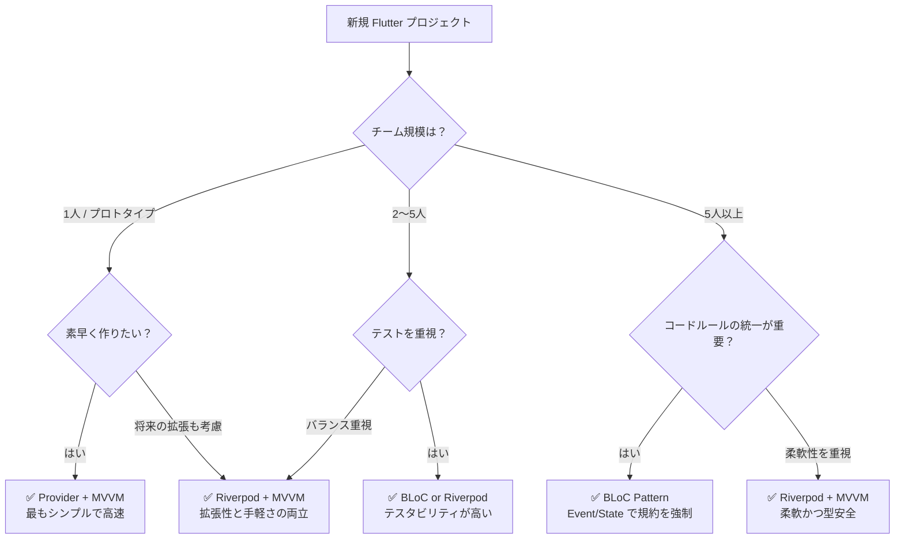

---

## 8. 共通構造と差分

3プロジェクトは共通の基盤を持ちつつ、状態管理層のみが異なる。

### 8.1 共通部分

| レイヤー           | 共通実装                                                |
| ------------------ | ------------------------------------------------------- |
| **DB**             | Drift (SQLite ORM) + `TodoData` テーブル                |
| **ナビゲーション** | go_router + go_router_builder（型安全ルーティング）     |
| **エンティティ**   | freezed による `Todo`, `TodoStats` イミュータブルクラス |
| **リポジトリIF**   | `abstract interface class TodoRepository`               |
| **リポジトリ実装** | `TodoRepositoryImpl` （TodoData ↔ Todo マッピング）     |
| **テーマ**         | Material 3 + NotoSansJP フォント                        |
| **UI構成**         | TodoList / CreateTodo / TodoDetail / Stats の4画面      |

### 8.2 差分箇所

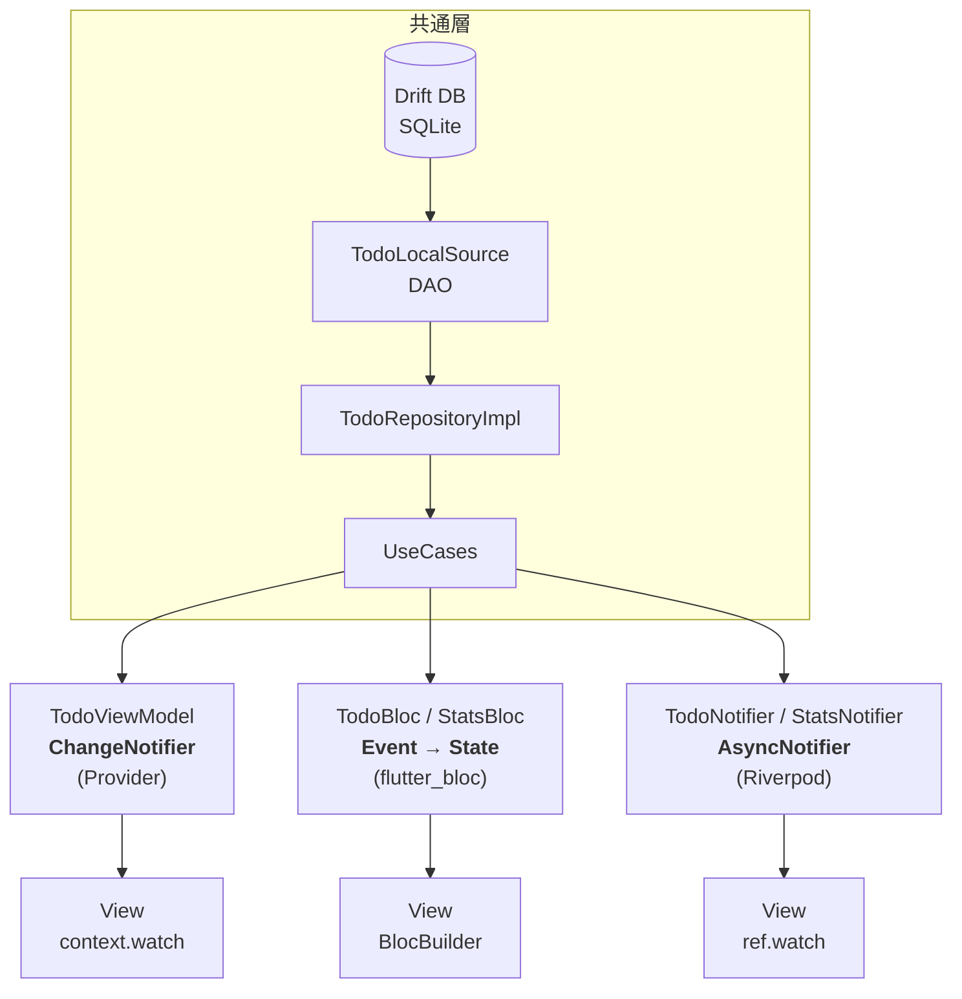

---

## 9. 状態管理コードの具体的な違い

### 9.1 Provider + MVVM（TodoViewModel）

```dart
class TodoViewModel extends ChangeNotifier {
  List<Todo> _allTodos = [];
  List<Todo> _filteredTodos = [];
  FilterType _filter = FilterType.all;

  void init() {
    _getTodosUseCase().listen((todos) {
      _allTodos = todos;
      _applyFilter();
    });
  }

  void setFilter(FilterType filter) {
    _filter = filter;
    _applyFilter();
  }

  void _applyFilter() {
    // フィルタ適用後 notifyListeners()
    notifyListeners();
  }
}
```

### 9.2 BLoC Pattern（TodoBloc）

```dart
class TodoBloc extends Bloc<TodoEvent, TodoState> {
  TodoBloc({...}) : super(const TodoState()) {
    on<TodoSubscriptionRequested>(_onSubscriptionRequested);
    on<TodoFilterChanged>(_onFilterChanged);
    on<TodoToggleCompleted>(_onToggleCompleted);
    // ...
  }

  Future<void> _onSubscriptionRequested(
    TodoSubscriptionRequested event,
    Emitter<TodoState> emit,
  ) async {
    await emit.forEach<List<Todo>>(
      _getTodosUseCase(),
      onData: (todos) => state.copyWith(
        allTodos: todos,
        filteredTodos: _applyFilter(todos, state.filter),
      ),
    );
  }
}
```

### 9.3 Riverpod + MVVM（TodoNotifier）

```dart
@riverpod
class TodoNotifier extends _$TodoNotifier {
  FilterType _filter = FilterType.all;
  List<Todo> _allTodos = [];

  @override
  FutureOr<List<Todo>> build() {
    final stream = ref.read(getTodosUseCaseProvider)();
    stream.listen((todos) {
      _allTodos = todos;
      state = AsyncData(_applyFilter(todos));
    });
    return [];
  }

  void setFilter(FilterType filter) {
    _filter = filter;
    state = AsyncData(_applyFilter(_allTodos));
  }
}
```

---

## 10. メリット・デメリットまとめ

### Provider + MVVM

| メリット                 | デメリット                                     |
| ------------------------ | ---------------------------------------------- |
| 学習コストが最も低い     | ライブラリの将来性に懸念（メンテナンスモード） |
| ボイラープレートが少ない | 大規模プロジェクトでの ChangeNotifier 肥大化   |
| Flutter 初心者に最適     | ミュータブル状態によるバグリスク               |
| 公式ドキュメントが充実   | スコープ管理がウィジェットツリーに依存         |
| セットアップが簡単       | テスト時の状態リセットがやや面倒               |

### BLoC Pattern

| メリット                           | デメリット                                    |
| ---------------------------------- | --------------------------------------------- |
| 厳密な単方向データフローで予測可能 | ボイラープレートが最も多い (Event/State/Bloc) |
| `bloc_test` による強力なテスト支援 | 学習コストが最も高い                          |
| 大規模プロジェクトでの保守性が高い | 小規模プロジェクトではオーバーキル            |
| 企業バック (VGV) で将来性が安定    | 新機能追加時の変更箇所が多い                  |
| チーム開発でのコード規約統一に最適 | Stream の理解が前提                           |

### Riverpod + MVVM

| メリット                                 | デメリット                              |
| ---------------------------------------- | --------------------------------------- |
| コード生成による型安全な DI              | コード生成への依存（build_runner 必須） |
| Provider の課題を解決した設計            | APIの破壊的変更がやや頻繁               |
| 遅延初期化 / スコープ管理が柔軟          | 独自概念が多く習得にやや時間がかかる    |
| AsyncValue による Loading/Error 状態管理 | 生成ファイル数が多い                    |
| テストでの Provider オーバーライドが容易 | 個人メンテナーへの依存                  |

---

## 11. 総合結論

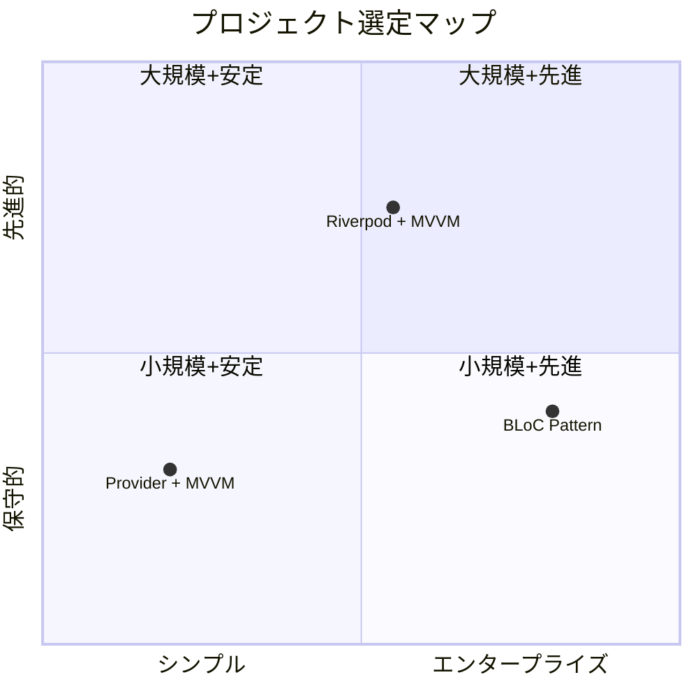

| 用途                             | 推奨パターン                | 理由                               |
| -------------------------------- | --------------------------- | ---------------------------------- |
| **Flutter 学習**                 | Provider + MVVM             | 最もシンプルで基礎概念の理解に最適 |
| **プロトタイプ / MVP**           | Provider + MVVM or Riverpod | 素早く実装でき、後者は拡張性も確保 |
| **スタートアップ**               | Riverpod + MVVM             | 柔軟性と型安全性のバランスが良い   |
| **受託開発**                     | BLoC Pattern                | コード規約の統一と保守性を重視     |
| **大規模エンタープライズ**       | BLoC Pattern                | 厳密なアーキテクチャと長期安定性   |
| **新規プロジェクト（2026年〜）** | Riverpod + MVVM or BLoC     | Provider は新規採用非推奨          |

> **最終的な選択は、チームの経験・プロジェクト規模・将来の保守計画を総合的に考慮して行うべきである。** どのパターンも本Todoアプリのような小〜中規模では十分に機能するが、スケールした際の特性の違いが顕著になる。

---

## おまけ: もし Riverpod + CQRS で作るとどうなるか？

本プロジェクトの Riverpod + MVVM 版をベースに、CQRS（Command Query Responsibility Segregation: コマンドクエリ責務分離）パターンを適用した場合のアーキテクチャを考察する。

### CQRS とは

CQRS は「データの読み取り（Query）」と「データの書き込み（Command）」の責務を明確に分離するアーキテクチャパターン。従来の CRUD 型リポジトリでは `watchAll()` / `add()` / `update()` / `delete()` を1つのインターフェースに集約するが、CQRS ではこれを **Query 側**と **Command 側**に分割する。

### アーキテクチャ図

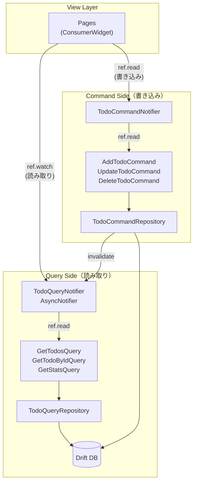

### フォルダ構成イメージ

```
lib/features/todo/
├── domain/
│   ├── entity/
│   │   ├── todo.dart
│   │   └── todo_stats.dart
│   ├── query/                        ← Query 側インターフェース
│   │   └── todo_query_repository.dart
│   └── command/                      ← Command 側インターフェース
│       └── todo_command_repository.dart
├── infrastructure/
│   ├── todo_local_source.dart
│   ├── todo_query_repository_impl.dart
│   └── todo_command_repository_impl.dart
├── query/                            ← Query UseCase
│   ├── get_todos_query.dart
│   ├── get_todo_by_id_query.dart
│   └── get_stats_query.dart
├── command/                          ← Command UseCase
│   ├── add_todo_command.dart
│   ├── update_todo_command.dart
│   └── delete_todo_command.dart
├── notifier/
│   ├── todo_query_notifier.dart      ← 読み取り専用 Notifier
│   ├── todo_command_notifier.dart    ← 書き込み専用 Notifier
│   └── stats_query_notifier.dart
└── pages/
    ├── todo_list_page.dart
    ├── create_todo_page.dart
    ├── todo_detail_page.dart
    └── stats_page.dart
```

### コードイメージ

```dart
// === Query 側 ===
abstract interface class TodoQueryRepository {
  Stream<List<Todo>> watchAll();
  Future<Todo?> findById(int id);
}

// === Command 側 ===
abstract interface class TodoCommandRepository {
  Future<void> add({required String title, String? memo});
  Future<void> update(Todo todo);
  Future<void> delete(int id);
}

// === Query Notifier（読み取り専用） ===
@riverpod
class TodoQueryNotifier extends _$TodoQueryNotifier {
  @override
  FutureOr<List<Todo>> build() {
    final stream = ref.read(getTodosQueryProvider)();
    stream.listen((todos) {
      state = AsyncData(_applyFilter(todos));
    });
    return [];
  }
  // フィルタリングなど読み取りロジックのみ
}

// === Command Notifier（書き込み専用） ===
@riverpod
class TodoCommandNotifier extends _$TodoCommandNotifier {
  @override
  void build() {} // 状態を持たない

  Future<void> addTodo({required String title, String? memo}) async {
    await ref.read(addTodoCommandProvider)(title: title, memo: memo);
    ref.invalidate(todoQueryNotifierProvider); // Query 側を再取得
  }

  Future<void> deleteTodo(int id) async {
    await ref.read(deleteTodoCommandProvider)(id: id);
    ref.invalidate(todoQueryNotifierProvider);
  }
}
```

### MVVM との比較

| 比較ポイント         | Riverpod + MVVM（現行） | Riverpod + CQRS                                       |
| -------------------- | ----------------------- | ----------------------------------------------------- |
| **リポジトリIF**     | `TodoRepository` 1つ    | `TodoQueryRepository` + `TodoCommandRepository` の2つ |
| **UseCase 分類**     | CRUD 操作で分類         | Query（読み取り）と Command（書き込み）で分類         |
| **Notifier 数**      | 2つ（Todo + Stats）     | 3つ以上（Query用 + Command用 + Stats用）              |
| **ファイル数**       | 少ない                  | 多い（責務分離のため）                                |
| **読み書きの独立性** | 同一Notifier内に混在    | 完全に分離                                            |
| **スケーラビリティ** | 中規模まで              | 大規模に強い                                          |
| **複雑さ**           | シンプル                | やや複雑                                              |

### CQRS を採用すべきケース

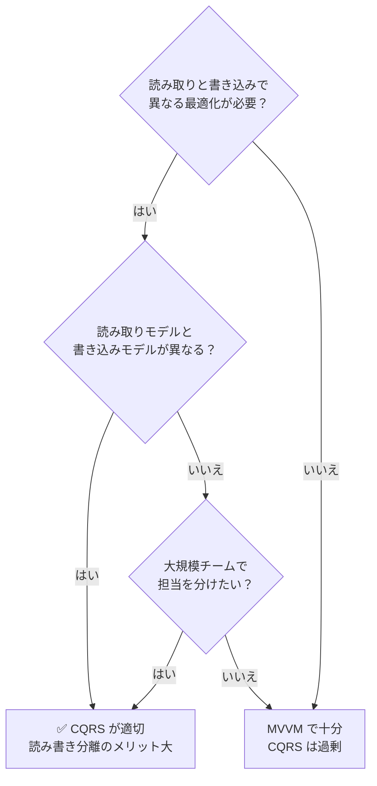

**CQRS が向いているケース:**

- 読み取りと書き込みでパフォーマンス要件が大きく異なる（例: 一覧は高速キャッシュ、書き込みは整合性重視）
- 読み取り用と書き込み用でデータモデルが異なる（例: 一覧用に非正規化した DTO を返す）
- バックエンドとの連携で Command は REST API、Query は GraphQL / WebSocket など異なるプロトコルを使う
- 大規模チームで「読み取り担当」「書き込み担当」を分業したい

**CQRS が過剰なケース:**

- 本Todoアプリ程度の小規模 CRUD アプリでは、読み書き分離のメリットよりファイル数・複雑性の増加がデメリットになる
- 読み取りと書き込みのモデルが同一で、特別な最適化も不要な場合

> **結論**: Todoアプリ規模であれば MVVM で十分だが、将来的にバックエンド連携やオフラインファースト設計、複雑なキャッシュ戦略が求められるプロジェクトでは、CQRS の責務分離が威力を発揮する。Riverpod の `ref.invalidate()` や Provider のオーバーライド機能は CQRS との親和性が高く、Query / Command の独立テストも容易になる。
