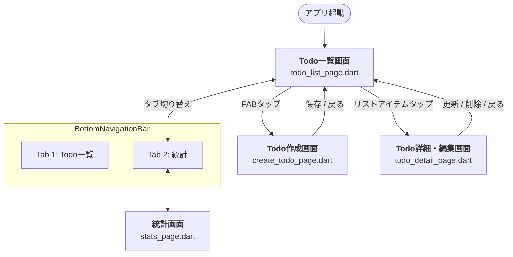

# 実装したいデモアプリの構成

- Flutter（Dart）で実装する。
- GoRouterを使い、2つのタブを持つ。
- freezedやbuild_runnerなどを用いてコードを自動生成し、堅牢かつ型安全な設計にする。
- 状態管理ライブラリはBLoC、Provider、Riverpodの3つを想定しており、それぞれを比較するために3つのプロジェクトを作る
- Drift、SQLiteを使ってローカルDBを実装する。これに対するCRUD操作を各状態管理ライブラリで行い、それぞれがどのようなフォルダ構成になりそれぞれどのようなCRUD実装になるかを比較する。
- どんなアーキテクチャパターンを使ったとしても、クリーンアーキテクチャを心がけること。

# 本アプリで想定するライブラリ

- GoRouter
- build_runner
- gorouter_builder
- freezed
- Drift
- SQLite
- flutter_riverpod
  - これはRiverpodを採用した場合のみ
- provider
  - これはProviderを採用した場合のみ
- flutter_bloc
  - これはBLoCを採用した場合のみ

# 使用想定のウィジェット

基本的にはFlutter標準のウィジェットを使用する。

# 命名規則

基本的にはlower_snake_caseを採用する。
例）`todo_page.dart`

アーキテクチャパターン特有の命名規則が存在する場合のみ検討する。

# フォント

Noto_Sans_JPを使用する。
以下2つのttfファイルで事足りる想定だが、必要に応じて追加する。

- NotoSansJP-Regular.ttf
- NotoSansJP-Bold.ttf

## 注意点

`assets/fonts`に配置すること。

# 状態管理ライブラリ

## BLoC

### アーキテクチャパターン

BLoCを採用する。

#### 採用理由

BLoCを利用した時の最適なアーキテクチャパターンはBLoCであるため。

## Provider

### アーキテクチャパターン

MVVMを採用する。

#### 採用理由

Providerを利用するときに一般的に用いられるアーキテクチャパターンのため。

## Riverpod

### アーキテクチャパターン

MVVMを採用する。

#### 採用理由

CQRSでもMVVMでも良いが、特にProviderと比較したいので今回はMVVMを採用する。

---

# アプリに実装する画面

## 画面一覧

| 画面名             | ファイル名              | 概要                                                                                                              |
| ------------------ | ----------------------- | ----------------------------------------------------------------------------------------------------------------- |
| Todo一覧画面       | `todo_list_page.dart`   | Tab 1のルート画面。Todoの一覧表示・ステータスフィルタリング（全て / 未完了 / 完了）・削除（スワイプ）・完了トグル |
| Todo作成画面       | `create_todo_page.dart` | Todo一覧画面のFABをタップして遷移。タイトル・メモを入力してDB登録                                                 |
| Todo詳細・編集画面 | `todo_detail_page.dart` | 一覧アイテムをタップして遷移。タイトル・メモの編集・削除が可能                                                    |
| 統計画面           | `stats_page.dart`       | Tab 2のルート画面。全件数・完了数・未完了数の集計表示                                                             |

## 各画面の機能詳細

### Todo一覧画面（`todo_list_page.dart`）

- BottomNavigationBar の Tab 1 に対応
- Drift経由でTodoを全件取得して一覧表示（Stream監視でリアルタイム更新）
- フィルタチップ（全て / 未完了 / 完了）でリスト絞り込み
- 各アイテムにチェックボックスを設け、タップで完了/未完了をトグル（Update）
- スワイプ削除（Dismissible）
- FAB（FloatingActionButton）タップでTodo作成画面へ遷移
- 一覧アイテムタップでTodo詳細・編集画面へ遷移

### Todo作成画面（`create_todo_page.dart`）

- タイトル入力フィールド（必須）
- メモ入力フィールド（任意・複数行）
- 「保存」ボタンでDBへInsertし、一覧画面に戻る
- バリデーション：タイトル未入力時はエラーメッセージ表示

### Todo詳細・編集画面（`todo_detail_page.dart`）

- 一覧から選択したTodoの内容を表示・編集
- タイトル・メモの編集が可能
- 「更新」ボタンでDBへUpdateし、一覧画面に戻る
- 「削除」ボタンでDBからDeleteし、一覧画面に戻る
- 完了状態のトグルも可能

### 統計画面（`stats_page.dart`）

- BottomNavigationBar の Tab 2 に対応
- Drift経由で集計：総Todo数・完了数・未完了数を表示
- グラフ等は使わず、テキストベースのシンプルな表示

## 画面遷移図



---

# 各アーキテクチャパターンのディレクトリ構成

## 共通方針

- クリーンアーキテクチャに基づき `view` / `logic` / `usecase` / `repository` / `domain` の5層に分離する。
  - `view` ： UI（ページ・ウィジェット）
  - `logic` ： 状態管理（BLoC / ViewModel / Notifier）。各ライブラリ固有の命名を優先する。
  - `usecase` ： アプリケーション層。ビジネスロジックの手順を組み立て、Repositoryを呼び出す。domainとlogicの橋渡し。
  - `repository` ： DBアクセス（Drift）の具象実装。テーブル定義・ローカルソース・Repository実装を置く。
  - `domain` ： エンティティとRepositoryの抽象インタフェースのみ。外部ライブラリに依存しない純粋Dart。
- **`domain`にUseCaseを入れない理由**：UseCaseは「Application Business Rules（アプリケーション層）」であり、Entityの「Enterprise Business Rules（ドメイン層）」とはクリーンアーキテクチャ上で別の層。概念の混濁を避けるため独立させる。
- **`domain`にRepository interfaceを入れる理由**：依存性逆転の原則（DIP）により、domain層がrepositoryのインタフェースを持ち、repository層がそれを実装する形にする。
- 自動生成ファイル（`.freezed.dart` / `.g.dart`）はソース管理に含めつつ、手動で編集しない。
- `core/` にアプリ横断的な設定（Router・Theme）を配置する。

### 各層の責務まとめ

| 層           | 対応するCA層                    | 責務                                       | 具体例                                        |
| ------------ | ------------------------------- | ------------------------------------------ | --------------------------------------------- |
| `view`       | Frameworks & Drivers（UI）      | 画面描画・ユーザー操作の受け取り           | `todo_list_page.dart`、Widget                 |
| `logic`      | Interface Adapters（Presenter） | 状態の保持・UseCaseの呼び出し              | BLoC / ViewModel / Notifier                   |
| `usecase`    | Application Business Rules      | ビジネス手順の組み立て・Repository呼び出し | `add_todo_usecase.dart`                       |
| `repository` | Frameworks & Drivers（DB）      | DBアクセス（Drift）・Repository実装        | テーブル定義、ローカルソース、Repository impl |
| `domain`     | Enterprise Business Rules       | ビジネスエンティティ・Repository抽象定義   | `todo.dart`、`todo_repository.dart`（抽象）   |

---

## BLoC（アーキテクチャパターン：BLoC）

BLoC パターンでは `bloc/` フォルダが `logic` 層に相当する。flutter_bloc の慣例を優先し、`bloc/` という名前をそのまま使う。

```
lib/
├── main.dart
├── app.dart
├── core/
│   ├── database/
│   │   ├── app_database.dart             ← @DriftDatabase（DB初期化・テーブル登録）
│   │   ├── app_database.g.dart           ← 自動生成
│   │   └── tables/
│   │       └── todo_table.dart           ← Driftテーブル定義
│   ├── router/
│   │   └── app_router.dart
│   └── theme/
│       └── app_theme.dart
└── features/
    └── todo/
        ├── view/                                 ← 画面・ウィジェット
        │   └── pages/
        │       ├── todo_list_page.dart
        │       ├── create_todo_page.dart
        │       ├── todo_detail_page.dart
        │       └── stats_page.dart
        ├── bloc/                                 ← logic層（BLoC慣例名をそのまま使用）
        │   ├── todo_bloc.dart                    ← BLoCの本体
        │   ├── todo_event.dart                   ← freezed sealed class
        │   ├── todo_event.freezed.dart            ← 自動生成
        │   ├── todo_state.dart                   ← freezed sealed class
        │   └── todo_state.freezed.dart            ← 自動生成
        ├── usecase/                              ← usecase層（アプリケーション層）
        │   ├── get_todos_usecase.dart
        │   ├── get_todo_by_id_usecase.dart
        │   ├── get_stats_usecase.dart
        │   ├── add_todo_usecase.dart
        │   ├── update_todo_usecase.dart
        │   └── delete_todo_usecase.dart
        ├── repository/                           ← repository層
        │   ├── todo_local_source.dart            ← Driftを使ったDB操作（ローカルソース）
        │   ├── todo_local_source.g.dart           ← 自動生成
        │   └── todo_repository_impl.dart         ← TodoRepository実装
        └── domain/                               ← domain層（entity + repository interfaceのみ）
            ├── entity/
            │   ├── todo.dart                     ← ドメインエンティティ（freezed）
            │   └── todo_stats.dart               ← 統計集計値オブジェクト（freezed）
            └── repository/
                └── todo_repository.dart          ← 抽象インタフェース
```

### BLoC 設計のポイント

- `bloc/` は flutter_bloc の慣例的なフォルダ名であり、`logic` 層に相当する。
- `TodoEvent` は `GetTodos` / `AddTodo` / `UpdateTodo` / `DeleteTodo` をfreezedのsealed classで定義。
- `TodoState` は `TodoInitial` / `TodoLoading` / `TodoLoaded` / `TodoError` をfreezedで定義。
- `BlocProvider` でツリーに注入し、各ページは `BlocBuilder` / `BlocListener` で状態を購読。
- `repository/` にDB操作ロジック（ローカルソース）とRepository実装のみを配置する。テーブル定義は `core/database/tables/` に一元管理する。
- UseCaseを通じてRepositoryを呼び出し、BLoCはドメイン層に直接依存しない（DI経由）。
- **Event/StateのEquality比較はfreezedで代替する**。freezedのsealed class生成時に `==` と `hashCode` が自動生成されるため、equatableは不要。

---

## Provider（アーキテクチャパターン：MVVM）

MVVMでは `view / view_model / repository / domain` がそれぞれ4層に対応する。`view_model/` が `logic` 層に相当。

```
lib/
├── main.dart
├── app.dart
├── core/
│   ├── database/
│   │   ├── app_database.dart             ← @DriftDatabase（DB初期化・テーブル登録）
│   │   ├── app_database.g.dart           ← 自動生成
│   │   └── tables/
│   │       └── todo_table.dart           ← Driftテーブル定義
│   ├── router/
│   │   └── app_router.dart
│   └── theme/
│       └── app_theme.dart
└── features/
    └── todo/
        ├── view/                                 ← View層（MVVM の V）
        │   └── pages/
        │       ├── todo_list_page.dart
        │       ├── create_todo_page.dart
        │       ├── todo_detail_page.dart
        │       └── stats_page.dart
        ├── view_model/                           ← logic層（MVVM の VM）
        │   └── todo_view_model.dart              ← ChangeNotifier継承、UseCaseを呼び出す
        ├── usecase/                              ← usecase層（アプリケーション層）
        │   ├── get_todos_usecase.dart
        │   ├── get_todo_by_id_usecase.dart
        │   ├── get_stats_usecase.dart
        │   ├── add_todo_usecase.dart
        │   ├── update_todo_usecase.dart
        │   └── delete_todo_usecase.dart
        ├── repository/                           ← repository層
        │   ├── todo_local_source.dart            ← Driftを使ったDB操作（ローカルソース）
        │   ├── todo_local_source.g.dart           ← 自動生成
        │   └── todo_repository_impl.dart
        └── domain/                               ← domain層（entity + repository interfaceのみ）
            ├── entity/
            │   ├── todo.dart
            │   └── todo_stats.dart               ← 統計集計値オブジェクト（freezed）
            └── repository/
                └── todo_repository.dart
```

### Provider 設計のポイント

- `view_model/` が `logic` 層に相当し、MVVM の ViewModel を配置する。
- `TodoViewModel` は `ChangeNotifier` を継承。状態（`List<Todo>` / `isLoading` / `errorMessage`）を保持し `notifyListeners()` で通知。
- `MultiProvider` でViewModelをツリーに注入。各ページは `context.watch<TodoViewModel>()` / `context.read<TodoViewModel>()` で参照。
- `repository/` にDB操作ロジック（ローカルソース）とRepository実装のみを配置する。テーブル定義は `core/database/tables/` に一元管理する。
- ViewModelはUseCaseを通じてRepository（抽象）を呼び出す。ViewはViewModelのみを参照し、データ層を知らない。

---

## Riverpod（アーキテクチャパターン：MVVM）

RiverpodのMVVMでは `notifier/` が `logic` 層に相当。riverpod_generator の慣例に従い `notifier/` を使う。

```
lib/
├── main.dart
├── app.dart
├── core/
│   ├── database/
│   │   ├── app_database.dart             ← @DriftDatabase（DB初期化・テーブル登録）
│   │   ├── app_database.g.dart           ← 自動生成
│   │   └── tables/
│   │       └── todo_table.dart           ← Driftテーブル定義
│   ├── router/
│   │   └── app_router.dart
│   └── theme/
│       └── app_theme.dart
└── features/
    └── todo/
        ├── view/                                 ← View層（ConsumerWidget）
        │   └── pages/
        │       ├── todo_list_page.dart
        │       ├── create_todo_page.dart
        │       ├── todo_detail_page.dart
        │       └── stats_page.dart
        ├── notifier/                             ← logic層（MVVM の VM に相当）
        │   ├── todo_notifier.dart                ← @riverpod + AsyncNotifier継承（一覧＋フィルタ状態管理）
        │   ├── todo_notifier.g.dart               ← 自動生成
        │   ├── stats_notifier.dart               ← @riverpod + StreamNotifier継承（統計画面用）
        │   └── stats_notifier.g.dart              ← 自動生成
        ├── usecase/                              ← usecase層（アプリケーション層）
        │   ├── get_todos_usecase.dart
        │   ├── get_todo_by_id_usecase.dart
        │   ├── get_stats_usecase.dart
        │   ├── add_todo_usecase.dart
        │   ├── update_todo_usecase.dart
        │   └── delete_todo_usecase.dart
        ├── repository/                           ← repository層
        │   ├── todo_local_source.dart            ← Driftを使ったDB操作（ローカルソース）
        │   ├── todo_local_source.g.dart           ← 自動生成
        │   ├── todo_repository_impl.dart
        │   └── todo_repository_provider.dart     ← @riverpod でRepository自体をDI
        └── domain/                               ← domain層（entity + repository interfaceのみ）
            ├── entity/
            │   ├── todo.dart
            │   └── todo_stats.dart               ← 統計集計値オブジェクト（freezed）
            └── repository/
                └── todo_repository.dart
```

### Riverpod 設計のポイント

- `notifier/` が `logic` 層に相当し、riverpod_generator の慣例に従った命名。
- `TodoNotifier` は `AsyncNotifier<List<Todo>>` を継承し、`@riverpod` アノテーションで Provider を自動生成。`build()` 内でDriftの `watchAll()` Streamを手動購読し、フィルタ状態（`_filter`）と全件リスト（`_allTodos`）をフィールドとして保持する。
- `ref.watch(todoNotifierProvider)` で状態購読。状態は `AsyncValue<List<Todo>>` で表現され、`when()` でLoading / Data / Error を分岐。
- `StatsNotifier` は `StreamNotifier<TodoStats>` を継承。統計は追加の可変フィールドが不要なため、`build()` でStreamをそのまま返せるStreamNotifierを採用する。
- `repository/` にDB操作ロジック（ローカルソース）とRepository実装のみを配置する。テーブル定義は `core/database/tables/` に一元管理する。
- RepositoryもRiverpodで管理し `ref.watch` でDI。BuildContextを跨いだDIが不要で、ProviderよりDI設計が明快。
- Providerとの比較：コードジェネレータ（riverpod_generator）を使うことで定義が簡潔になる一方、`ConsumerWidget` / `ConsumerStatefulWidget` への変更が必要。

---

# pubspec.yaml 依存ライブラリ

## 共通（3プロジェクト共通）

```yaml
dependencies:
  flutter:
    sdk: flutter

  # ナビゲーション
  go_router: ^14.0.0

  # コード生成（アノテーション）
  freezed_annotation: ^2.4.4
  json_annotation: ^4.9.0

  # ローカルDB
  drift: ^2.20.0
  sqlite3_flutter_libs: ^0.5.24
  path_provider: ^2.1.5
  path: ^1.9.0

dev_dependencies:
  flutter_test:
    sdk: flutter
  flutter_lints: ^5.0.0

  # コード生成
  build_runner: ^2.4.13
  freezed: ^2.5.7
  json_serializable: ^6.8.0
  drift_dev: ^2.20.0
  go_router_builder: ^2.7.2
```

## BLoC プロジェクト追加分

```yaml
dependencies:
  # 状態管理
  flutter_bloc: ^8.1.6
```

> **equatableを使わない理由**：`TodoEvent` / `TodoState` はfreezedのsealed classとして定義するため、`==` と `hashCode` がfreezedによって自動生成される。equatableが提供する機能はfreezedで完全に代替可能であり、依存を増やすだけになるため採用しない。

## Provider プロジェクト追加分

```yaml
dependencies:
  # 状態管理
  provider: ^6.1.2
```

## Riverpod プロジェクト追加分

```yaml
dependencies:
  # 状態管理
  flutter_riverpod: ^2.5.1
  riverpod_annotation: ^2.3.5

dev_dependencies:
  # コード生成（Notifier / Provider の自動生成）
  riverpod_generator: ^2.4.3
  custom_lint: ^0.6.7
  riverpod_lint: ^2.3.13
```

## バージョン選定の注意点

- 上記バージョンはメモ作成時点（2026年3月）を基準としているため、実際にプロジェクトを作成する際は `flutter pub outdated` で最新バージョンを確認すること。
- `drift` と `drift_dev` はメジャーバージョンを必ず合わせること。
- `go_router_builder` は `go_router` とのバージョン整合性を確認すること。

---

# 実装詳細仕様

## DBスキーマ

### Todoテーブル（`todos`）

| カラム名       | Dart型    | SQLite型 | 制約                      | 説明                           |
| -------------- | --------- | -------- | ------------------------- | ------------------------------ |
| `id`           | `int`     | INTEGER  | PRIMARY KEY AUTOINCREMENT | 主キー（自動採番）             |
| `title`        | `String`  | TEXT     | NOT NULL                  | Todoのタイトル                 |
| `memo`         | `String?` | TEXT     | NULL許容                  | Todoのメモ（任意入力）         |
| `is_completed` | `bool`    | INTEGER  | NOT NULL, DEFAULT 0       | 完了フラグ（0=未完了, 1=完了） |

- `created_at` / `updated_at` は持たない（シンプル構成優先のため）
- `memo` はNULL許容（任意入力のため）

---

## domainエンティティ定義

`todo.dart`（freezed）のフィールド定義：

```dart
@freezed
class Todo with _$Todo {
  const factory Todo({
    required int id,
    required String title,
    String? memo,
    required bool isCompleted,
  }) = _Todo;
}
```

- DBスキーマと1対1の対応
- `is_completed`（snake_case）→ `isCompleted`（camelCase）にDrift側でマッピング
- freezedにより `==` / `hashCode` / `copyWith` が自動生成される
- `json_serializable` は使用しない（DBアクセスはDriftが担当するため）

統計画面用の集計値オブジェクト（`todo_stats.dart`）：

```dart
@freezed
class TodoStats with _$TodoStats {
  const factory TodoStats({
    required int total,
    required int completed,
    required int incompleted,
  }) = _TodoStats;
}
```

---

## Repositoryインターフェース

### メソッド一覧

```dart
abstract interface class TodoRepository {
  Stream<List<Todo>> watchAll();
  Future<Todo?> findById(int id);
  Future<void> add({required String title, String? memo});
  Future<void> update(Todo todo);
  Future<void> delete(int id);
}
```

### watchAll() と findById() が必要な理由

| メソッド           | 理由                                                                                                                                                               |
| ------------------ | ------------------------------------------------------------------------------------------------------------------------------------------------------------------ |
| `watchAll()`       | DriftはDBの変更をリアルタイムで検知できるStreamを提供する。これを使うことでInsert/Update/Delete後に一覧画面が自動更新される。ポーリング不要。                      |
| `findById(int id)` | 詳細・編集画面ではURLパスパラメータのIDからTodoを1件取得する必要がある。一覧StreamからIDで探す実装も可能だが、責務を明確にするため独立したメソッドとして定義する。 |

### 統計情報の取得

統計画面の集計値はRepositoryに専用メソッドを設けず、`GetStatsUseCase` 内で `watchAll()` のStreamを加工して算出する。

---

## UseCaseシグネチャ定義

### 方針

- 各UseCaseは単一の `call()` メソッドのみを持つ（Single Responsibility）
- 引数は操作に必要な最小限のパラメータを受け取る（UpdateのみエンティティTodoをそのまま渡す）
- 戻り値は操作内容に応じて `Stream` または `Future` を使い分ける
- 受け取るStateはエンティティ単位（`List<Todo>` / `Todo?` / `TodoStats`）。フィールドを絞った部分取得は行わない

### 各UseCaseの定義

| UseCase              | 引数                           | 戻り値               | 説明                 |
| -------------------- | ------------------------------ | -------------------- | -------------------- |
| `GetTodosUseCase`    | なし                           | `Stream<List<Todo>>` | 全件をStream取得     |
| `GetTodoByIdUseCase` | `id: int`                      | `Future<Todo?>`      | 詳細画面用の1件取得  |
| `GetStatsUseCase`    | なし                           | `Stream<TodoStats>`  | 統計情報のStream取得 |
| `AddTodoUseCase`     | `title: String, memo: String?` | `Future<void>`       | 新規登録             |
| `UpdateTodoUseCase`  | `todo: Todo`                   | `Future<void>`       | 既存Todoを更新       |
| `DeleteTodoUseCase`  | `id: int`                      | `Future<void>`       | IDを指定して削除     |

```dart
// GetStatsUseCase の実装例
class GetStatsUseCase {
  const GetStatsUseCase(this._repository);
  final TodoRepository _repository;

  Stream<TodoStats> call() => _repository.watchAll().map(
        (todos) => TodoStats(
          total: todos.length,
          completed: todos.where((t) => t.isCompleted).length,
          incompleted: todos.where((t) => !t.isCompleted).length,
        ),
      );
}
```

---

## GoRouterのルート定義

### プロジェクトルール：`extra` 禁止

> **ルール**: GoRouterの画面遷移でデータを渡す場合は、必ずパスパラメータまたはクエリパラメータを使用すること。`extra` によるデータ渡しは禁止する。
>
> **理由**: `extra` はURLに反映されないため、ディープリンクやブラウザの戻るボタンで状態が再現できない。型安全性も低下する。

### パス定義

```
/todos              → Todo一覧画面（Tab 1 ルート）
/todos/create       → Todo作成画面
/todos/:id          → Todo詳細・編集画面（:id は int型のTodo ID）
/stats              → 統計画面（Tab 2 ルート）
```

### go_router_builder での型安全ルート定義（概要）

```dart
// BottomNavigationBar は StatefulShellRoute で構成
@TypedStatefulShellRoute<MainShellRouteData>(
  branches: [
    TypedStatefulShellBranch<TodoBranchData>(
      routes: [
        TypedGoRoute<TodoListRoute>(
          path: '/todos',
          routes: [
            TypedGoRoute<CreateTodoRoute>(path: 'create'),
            TypedGoRoute<TodoDetailRoute>(path: ':id'),
          ],
        ),
      ],
    ),
    TypedStatefulShellBranch<StatsBranchData>(
      routes: [
        TypedGoRoute<StatsRoute>(path: '/stats'),
      ],
    ),
  ],
)
```

---

## Driftデータベースクラスの配置

### 方針

`AppDatabase`（`@DriftDatabase` を持つクラス）は3プロジェクト共通の構造として `core/database/` に配置する。テーブル定義は `core/database/tables/` に切り出して管理する。

### ディレクトリ構成（共通）

```
core/
├── database/
│   ├── app_database.dart         ← @DriftDatabase（テーブル登録・DB初期化）
│   ├── app_database.g.dart       ← 自動生成
│   └── tables/
│       └── todo_table.dart       ← Driftテーブル定義（TodosTableクラス）
├── router/
│   └── app_router.dart
└── theme/
    └── app_theme.dart
```

`repository/` にはDB操作ロジック（ローカルソース）とRepository実装のみを配置する。

---

## 各パターンのDI初期化構成（main.dart / app.dart）

### BLoC

```dart
// main.dart
void main() async {
  WidgetsFlutterBinding.ensureInitialized();
  final db = AppDatabase();
  runApp(App(db: db));
}

// app.dart：MultiBlocProviderでルートに注入
MultiBlocProvider(
  providers: [
    BlocProvider(create: (_) => TodoBloc(...)),
  ],
  child: MaterialApp.router(...),
)
```

### Provider

```dart
// main.dart
void main() async {
  WidgetsFlutterBinding.ensureInitialized();
  final db = AppDatabase();
  runApp(App(db: db));
}

// app.dart：MultiProviderでViewModelをルートに注入
MultiProvider(
  providers: [
    ChangeNotifierProvider(create: (_) => TodoViewModel(...)),
  ],
  child: MaterialApp.router(...),
)
```

### Riverpod

```dart
// main.dart
void main() async {
  WidgetsFlutterBinding.ensureInitialized();
  runApp(const ProviderScope(child: App()));
}

// AppDatabaseはRiverpodのProviderで管理
@riverpod
AppDatabase appDatabase(Ref ref) {
  final db = AppDatabase();
  ref.onDispose(db.close);
  return db;
}
```

---

## フィルタリング実装方針

### 方針：ViewModelレイヤーでフィルタリング

- DBには常に全件取得（`watchAll()`）のみ行う
- フィルタ状態（全て / 未完了 / 完了）をViewModel / State側で保持する
- ViewModelがフィルタを適用したリストをViewに渡す

### 採用理由

- **シンプルさ優先**：Todoアプリのデモであり件数が少ないため、メモリ上のフィルタリングで十分
- **Stream連携の容易さ**：`watchAll()` の `Stream<List<Todo>>` を1本持てばよく、フィルタ変更のたびにDBクエリを発行する必要がない
- **DBクエリ最小化**：フィルタ条件ごとに別Streamを張る必要がなく、実装がシンプルになる

> **補足**：件数が非常に多くメモリ使用量が問題になる場合はDBクエリでフィルタするほうが適切。今回はスコープ外。

---

## Stream監視の方針

### BLoC

`on<GetTodos>` ハンドラ内で `emit.forEach()` を使い、Streamをそのまま購読する。

```dart
on<GetTodos>((event, emit) async {
  await emit.forEach<List<Todo>>(
    _getTodosUseCase(),
    onData: (todos) => TodoLoaded(todos: todos),
    onError: (_, __) => const TodoError(message: 'データの取得に失敗しました'),
  );
});
```

### Provider

ViewModelの `init()` メソッドで `StreamSubscription` を張り、新しいデータが来るたびに `notifyListeners()` を呼ぶ。`dispose()` でサブスクリプションをキャンセルする。

```dart
class TodoViewModel extends ChangeNotifier {
  StreamSubscription<List<Todo>>? _subscription;

  void init() {
    _subscription = _getTodosUseCase().listen(
      (todos) {
        _todos = todos;
        notifyListeners();
      },
      onError: (e) {
        _errorMessage = e.toString();
        notifyListeners();
      },
    );
  }

  @override
  void dispose() {
    _subscription?.cancel();
    super.dispose();
  }
}
```

### Riverpod

`TodoNotifier` は `AsyncNotifier` を継承し、`build()` 内でStreamを手動購読する。フィルタ状態をフィールドとして保持でき、フィルタ変更のたびに `state` を更新する。

```dart
@riverpod
class TodoNotifier extends _$TodoNotifier {
  FilterType _filter = FilterType.all;
  List<Todo> _allTodos = [];
  StreamSubscription<List<Todo>>? _sub;

  @override
  Future<List<Todo>> build() async {
    _sub = ref.watch(getTodosUseCaseProvider).call().listen(
      (todos) {
        _allTodos = todos;
        state = AsyncData(_applyFilter(todos));
      },
      onError: (e, st) => state = AsyncError(e, st),
    );
    ref.onDispose(() => _sub?.cancel());
    return [];
  }

  void setFilter(FilterType filter) {
    _filter = filter;
    state = AsyncData(_applyFilter(_allTodos));
  }

  List<Todo> _applyFilter(List<Todo> todos) => switch (_filter) {
    FilterType.all => todos,
    FilterType.completed => todos.where((t) => t.isCompleted).toList(),
    FilterType.incompleted => todos.where((t) => !t.isCompleted).toList(),
  };
}
```

`StatsNotifier` は追加の可変フィールドが不要なため `StreamNotifier` を採用し、`build()` でStreamをそのまま返す。

```dart
@riverpod
class StatsNotifier extends _$StatsNotifier {
  @override
  Stream<TodoStats> build() {
    return ref.watch(getStatsUseCaseProvider).call();
  }
}
```

> `TodoNotifier` に `AsyncNotifier` を採用する理由：フィルタ状態（`_filter`）と全件リスト（`_allTodos`）という追加の可変フィールドを持つ必要があるため。`StreamNotifier` では `build()` がStreamを返すだけで追加フィールドの管理が難しい。`StatsNotifier` は追加フィールドが不要なためStreamNotifierで十分。

---

## エラーハンドリング方針

### 基本方針

- DB操作失敗時のエラーはStateで保持する
- ユーザーへの表示はViewレイヤーで行う（State変化を検知してSnackBarを表示するなど）

### 各パターンのエラー表現

| パターン | エラー状態の表現                                                                       |
| -------- | -------------------------------------------------------------------------------------- |
| BLoC     | `TodoError(message: String)` をfreezedのSealed Stateとして定義                         |
| Provider | ViewModel の `String? errorMessage` フィールド + `notifyListeners()`                   |
| Riverpod | `AsyncValue.error` として自動的に表現される（`AsyncNotifier` / `StreamNotifier` 共通） |

---

## Makefile

プロジェクトルートに `Makefile` を配置し、よく使うコマンドを定義する。

```makefile
.PHONY: run_build_runner

run_build_runner:
	dart run build_runner build --delete-conflicting-outputs
```

実行コマンド：

```bash
make run_build_runner
```

---

## テスト方針

### スコープ

| テスト種別         | 対象                                  | 使用ライブラリ         |
| ------------------ | ------------------------------------- | ---------------------- |
| ユニットテスト     | UseCase / ViewModel / BLoC / Notifier | `flutter_test`（標準） |
| ウィジェットテスト | 各ページ（View層）                    | `flutter_test`（標準） |

- `flutter_test` のみ使用（外部モックライブラリは導入しない）
- テストダブルは手動スタブで対応（`FakeTodoRepository` を手動実装）

### ディレクトリ構成

```
test/
└── features/
    └── todo/
        ├── usecase/
        │   ├── get_todos_usecase_test.dart
        │   ├── get_todo_by_id_usecase_test.dart
        │   ├── get_stats_usecase_test.dart
        │   ├── add_todo_usecase_test.dart
        │   ├── update_todo_usecase_test.dart
        │   └── delete_todo_usecase_test.dart
        ├── logic/                            ← BLoC / ViewModel / Notifier のテスト
        │   └── todo_bloc_test.dart           （パターンによりファイル名が変わる）
        └── view/
            ├── todo_list_page_test.dart
            ├── create_todo_page_test.dart
            ├── todo_detail_page_test.dart
            └── stats_page_test.dart
```
